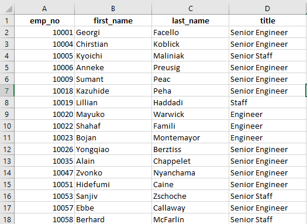
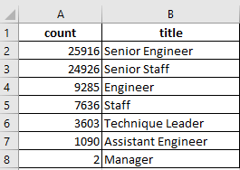
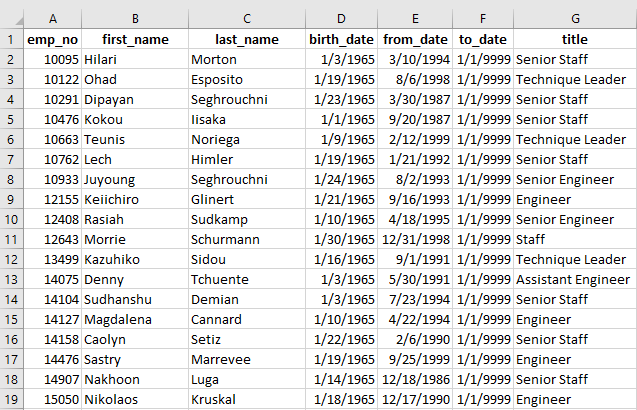

# Pewlett-Hackard-Analysis
## Overview of the Analysis
In order to ensure the seemless operation of a large corporation, the number of current employees retiring in the near future was determined.  Additionally, the future retirees were grouped by job title to see the amount of losses each position would incur, but also to determine how many potential retirees could act as mentors for younger company employees.  The number of employees who are eligible to participate in a mentorship program was also tabulated to see how many current employees would be availabe to fill the retirement positions.    

Data from the corporation was originally kept in CSV files and read using EXCEL.  These CSV files were uploaded into a Postgres database, where the data was linked together and queried to generate an assortement of data tables.  As discussed below, database queries quickly determined the number of retirees, which ones would make suitable mentors, and the number of mid-career employees availabe to be mentored.

## Results
* The majority of upcoming retirees have senior level positions.  
A "retirement titles" table that holds all the titles of employees who were born between January 1, 1952 and December 31, 1955 was created.  A sample of the table can be seen in the image below.  Only the most recent title of current employees was included in the table.  In the sample of data shown, the majority of individuals have senior positions, e.g. "senior engineer".  

  
* Engineering and Staff positions have the most retirees.
The most current titles of potentially retireeing individuals was grouped by name in order to determine the number and types of positions that will need to be filled.  The table below gives a breakdown from greatest to least amount of upcomong vacancies.  It can be anticipated that aroiund 36,000 engineers, 33,000 staff and 4,000 technique leaders positions will need to be filled due to retirement.   

* A small number of mid-career level employees are available for the mentorship program. 
A mentorship-eligibility table that holds the current employees who were born between January 1, 1965 and December 31, 1965 was created.  A sample of data from the table can bee seen below.  Several of the individuals listed have titles of "engineer" or "staff", hence meaning they could possibly be mentored into a senior level position.      

* Many mid-career employees already have senior positions 
In the same table above showing a sampling of job titles for mid-career employees, it is evident that many of them already hold senior level positions.  Hence, there would be no need to mentor them.  Further analysis and an expansion of the pool of potential mentorship-eligible candidates should be performed.  

## Summary
Overall, 

### How many roles will need to be filled?
Explanation with supporting figure below

### Are there enough qualified, retirement-ready employees to mentor?
Explanation with supporting figure below

 
