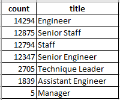

# Pewlett-Hackard-Analysis
## Overview of the Analysis
In order to ensure the seamless operation of a large corporation, the number of current employees retiring in the near future was determined.  Additionally, the future retirees were grouped by job title to see the number of losses each position would incur, but also to determine how many potential retirees could act as mentors for younger company employees.  The number of employees who are eligible to participate in a mentorship program was also tabulated to see how many current employees would be availabe to fill the retirement positions.    

Data from the corporation was originally kept in CSV files and read using EXCEL.  These CSV files were uploaded into a Postgres database, where the data was linked together and queried to generate an assortment of data tables.  As discussed below, database queries quickly determined the number of retirees, which ones would make suitable mentors, and the number of mid-career employees available to be mentored.

## Results
* The majority of upcoming retirees have senior level positions.  

A "retirement titles" table that holds all the titles of employees who were born between January 1, 1952 and December 31, 1955 was created.  A sample of the table can be seen in the image below.  Only the most recent title of current employees was included in the table.  In the sample of data shown, the majority of individuals have senior positions, e.g. "senior engineer".  

  
* Engineering and Staff positions have the most retirees.

The most current titles of potentially retiring individuals were grouped by name in order to determine the number and types of positions that will need to be filled.  The table below gives a breakdown from greatest to least amount of upcoming vacancies.  It can be anticipated that around 36,000 engineers, 33,000 staff and 4,000 technique leaders positions will need to be filled due to retirement.   

* A small number of mid-career level employees are available for the mentorship program. 

A mentorship-eligibility table that holds the current employees who were born between January 1, 1965 and December 31, 1965 was created.  A sample of data from the table can be seen below.  Several of the individuals listed have titles of "engineer" or "staff", hence meaning they could possibly be mentored into a senior level position.      

* Many mid-career employees already have senior positions 

In the same table above showing a sampling of job titles for mid-career employees, it is evident that many of them already hold senior level positions.  Hence, there would be no need to mentor them.  Further analysis and an expansion of the pool of potential mentorship-eligible candidates should be performed.  

## Summary
### How many roles will need to be filled?
In the next four years, it is anticipated that 72,458 positions will need to be filled due to retirement.  This data is based upon current employees from 1952-55.  To see if the rate of retiring employees will extend past this date, another query was performed to see the potential retirees from employees born from 1956-1959.  The titles and numbers of employees can be seen in the table below.  A quick observation shows the numbers of retirees born in 1956-1959 is very similar to the number of retirees born in 1952-1955, with a total of 73,910 positions needing to be filled.  Hence, the rate of retirement appears to be consistent over the next 8 years with an anticipated hiring rate of 9100 engineers per year, 8200 staff per year, and 950 technique leaders per year.  

### Are there enough qualified, retirement-ready employees to mentor?
In the next four years, there appears to be more than enough qualified, retirement ready employees who can mentor.  With approximately 25,000 senior engineers and 25,000 senior staff retiring, compared to a total of 1549 employees who were born in 1965, and most of which are already senior level associates.  To make the comparison fairer, the amount of potential mentorship-eligible employees was expanded to a four-year range to match the retirement range used previously.  Specifically, a table of current mid-career employees and their job titles between January 1, 1962 to December 31, 1965 was created and can be seen below.  It is similar to the one shown in the results section, with the difference being the birth dates range over four years and there are now a total of 56,859 potential employees that can be mentored into a senior level position.  

To further break down the potential mentorship-eligible pool of employees, the list above was grouped by job title to see the numbers of mid-career employees in each position.  The table below shows how they are grouped, with most being engineers.  With regards to mentorship, with the expanded mid-career employee group there are over 12,000 engineers and 12,000 staff members available to be mentored.  With approximately double the number of senior engineers and senior staff retiring, there are plenty of available mentors for these individuals.    

To conclude, in the next four years approximately 50,000 total senior level employees will be retiring.  With proper mentorship, approximately half of these individuals can be replaced by mid-career employees ten years their junior.  

 
